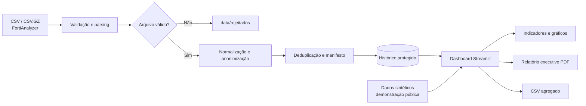

<div align="center">

# 📡 Observatório Wi-Fi UFF · SBPC

### Análise de utilização, capacidade e qualidade da rede em eventos de grande porte.

[](https://www.python.org/)
[](https://streamlit.io/)
[](https://github.com/fabioconceicao22/dashboard-wifi-uff-sbpc/actions/workflows/ci.yml)
[](#dados-e-lgpd)
[](#dados-e-lgpd)
[](LICENSE)

</div>

## Sobre o projeto

O **Observatório Wi-Fi UFF · SBPC** transforma exportações do FortiAnalyzer em indicadores operacionais, análises temporais e relatórios executivos em PDF.

> A demonstração pública utiliza somente dados sintéticos. Nenhuma métrica deste repositório representa resultado oficial da UFF ou da SBPC.

## ✨ Principais recursos

- visão executiva de clientes, pico de utilização, SSID e ponto de acesso líder;
- filtros por período, SSID, granularidade e escopo de análise;
- análises por SSID, ponto de acesso, horário e qualidade de rádio;
- importação incremental de CSV e CSV.GZ, com deduplicação;
- anonimização de dispositivos antes da persistência;
- relatório PDF com identidade visual, gráficos, metodologia e observações LGPD;
- base sintética reprodutível para demonstração e portfólio;
- testes automatizados e integração contínua com GitHub Actions.

## 🏗 Arquitetura

```text
app.py                         interface e visualizações Streamlit
services/parser_fortianalyzer.py  ingestão, normalização e anonimização
services/relatorio_pdf.py      relatório executivo em PDF
scripts/generate_demo_data.py  gerador da base pública sintética em memória
data/                          diretórios locais protegidos pelo .gitignore
tests/                         testes de privacidade e parsing
```



## 🚀 Como executar

```bash
python -m venv .venv
# Windows: .venv\Scripts\activate
# Linux/macOS: source .venv/bin/activate
pip install -r requirements.txt
python scripts/generate_demo_data.py  # opcional: o app também gera a demonstração em memória
streamlit run app.py
```

Acesse `http://localhost:8501`.

## 🔐 Importar logs reais com segurança

1. Defina um segredo privado e estável com pelo menos 16 caracteres:

   ```bash
   # PowerShell
   $env:WIFI_HASH_SALT = "seu-segredo-privado-e-forte"
   ```

2. Coloque arquivos `.csv` ou `.csv.gz` em `data/importar`.
3. Use **Processar arquivos novos** no dashboard ou execute `python importar_logs.py`.

Para manter somente um mês específico, use a importação mensal segura:

```bash
python -m scripts.import_month caminho/arquivo.csv.gz --year 2026 --month 7
```

Se o mês solicitado não existir no arquivo, o comando termina sem substituir o histórico.

O segredo não deve ser trocado entre importações do mesmo histórico, pois ele garante identificadores anônimos consistentes. Nunca o envie ao GitHub.

## 🛡 Dados e LGPD

O parser descarta o endereço MAC original e o endereço IP. Apenas um identificador derivado por hash com segredo privado é persistido. Mesmo assim, o histórico operacional deve permanecer em infraestrutura autorizada pela UFF e nunca em repositório público.

## ☁️ Deploy

O Streamlit Community Cloud é indicado para esta demonstração sintética. Para uso operacional, recomenda-se execução em ambiente institucional com armazenamento persistente e acesso controlado ao FortiAnalyzer.

## 🧰 Tecnologias

Python, Streamlit, Pandas, Plotly, Matplotlib, ReportLab, Pytest e GitHub Actions.

## 👤 Autor

Projeto de portfólio de **Fabio Leite** · [GitHub](https://github.com/fabioconceicao22) · [LinkedIn](https://www.linkedin.com/in/fabio-concei%C3%A7%C3%A3o95/), desenvolvido a partir de uma experiência de análise do uso de Wi-Fi durante a SBPC na Universidade Federal Fluminense.

